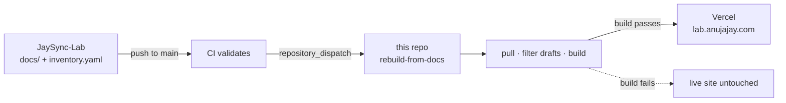

# 🌐 jaysync-lab-site

> The **Next.js + Fumadocs** site that publishes the JaySync-Lab homelab docs — live at **[lab.anujajay.com](https://lab.anujajay.com)**.

[](https://github.com/JaySync-Lab/jaysync-lab-site/actions/workflows/rebuild-from-docs.yml)
[](https://lab.anujajay.com)


A documentation **and** portfolio site: a designed homepage (live topology, VMID band diagram, neofetch-style host panel) fronting a full Fumadocs docs section. It renders content it does **not** own — everything is pulled from [JaySync-Lab](https://github.com/JaySync-Lab/JaySync-Lab), so this repo is presentation, not source.

---

## 🔗 How it fits

| Repo | What it is | Live |
|:-----|:-----------|:-----|
| [JaySync-Lab](https://github.com/JaySync-Lab/JaySync-Lab) | Infrastructure docs + inventory — the source of truth | — |
| **jaysync-lab-site** *(here)* | Publishes those docs | [lab.anujajay.com](https://lab.anujajay.com) |
| [jaysync-lab-playground](https://github.com/JaySync-Lab/jaysync-lab-playground) | Disposable in-browser Linux terminal sessions | [jslnode.anujajay.com](https://jslnode.anujajay.com) |

## 🔄 Content pipeline

Docs and the inventory are **auto-synced** from JaySync-Lab — never hand-edited here:



Content lives in `content/` (docs) and `src/data/inventory.yaml` — both overwritten on every sync. To change what the site shows, edit [JaySync-Lab](https://github.com/JaySync-Lab/JaySync-Lab) and push.

---

## 🧱 Tech stack

| Layer | Choice |
|:------|:-------|
| Framework | Next.js 15 (App Router) · React 19 · TypeScript |
| Docs engine | Fumadocs 14 (MDX) |
| Styling / motion | Tailwind CSS 4 · Motion · Lucide icons |
| Data | `inventory.yaml` via js-yaml |
| Hosting | Vercel |

## 🚀 Local development

```bash
npm install
npm run dev      # http://localhost:3000
npm run build    # production build (the pipeline's pre-flight gate)
```

> Editing docs? Don't do it here — edit `docs/` in [JaySync-Lab](https://github.com/JaySync-Lab/JaySync-Lab) and push. See its [`RULEBOOK.md`](https://github.com/JaySync-Lab/JaySync-Lab/blob/main/RULEBOOK.md).

**Status:** live in production at [lab.anujajay.com](https://lab.anujajay.com).
