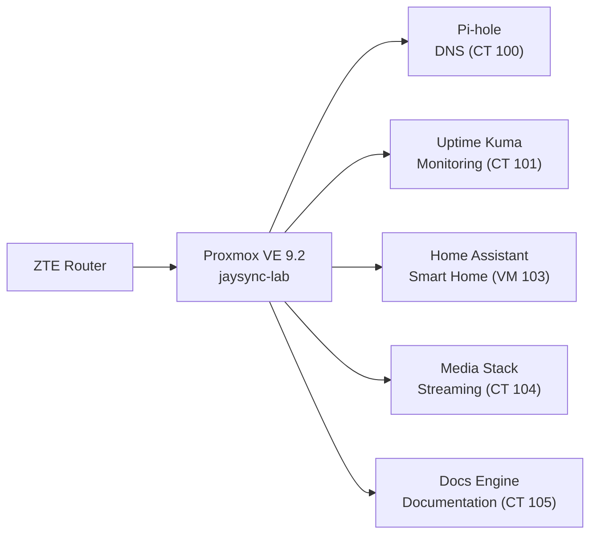

# JaySync-Lab

> [!NOTE]
> High-performance home server built on Proxmox, emphasizing security (SOPS), monitoring, and smart home integration.

## Architecture

## Tech Stack

- **Hardware:** HP ProDesk 400 G3 MT — Intel i5-6500, 16GB DDR4
- **Hypervisor:** Proxmox VE 9.2.3 (Kernel 7.0.6-2-pve)
- **Base OS:** Debian GNU/Linux 13 (trixie)
- **Containers:** Debian LXCs (Unprivileged)
- **Virtual Machines:** Home Assistant OS (HAOS VM)
- **Networking/VPN:** Tailscale (bare-metal)
