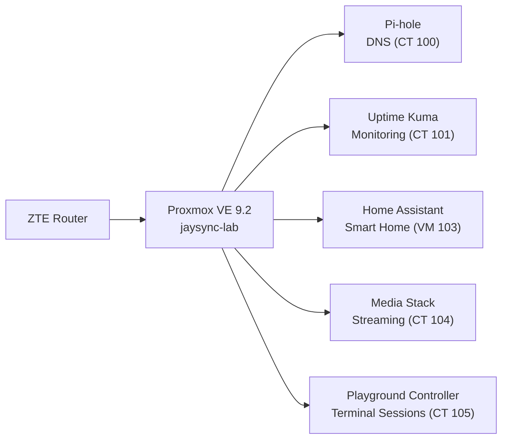

## Overview

JaySync-Lab is a personal homelab built on Proxmox VE, running on repurposed
enterprise hardware. This site is the browser-facing view of the
infrastructure documentation — every page here is sourced directly from the
[`JaySync-Lab`](https://github.com/JaySync-Lab/JaySync-Lab) repository, which
is the single source of truth.

## Architecture

## Tech Stack

- **Hardware:** HP ProDesk 400 G3 MT — Intel i5-6500, 16GB DDR4
- **Hypervisor:** Proxmox VE 9.2.3 (Kernel 7.0.6-2-pve)
- **Base OS:** Debian GNU/Linux 13 (trixie)
- **Containers:** Debian LXCs (unprivileged)
- **Virtual Machines:** Home Assistant OS (HAOS VM)
- **Networking/VPN:** Tailscale (bare-metal)

Start with [Infrastructure](/docs/infrastructure/hardware) for the physical
build, or jump straight to [Services](/docs/services/pi-hole) for individual
container writeups.
